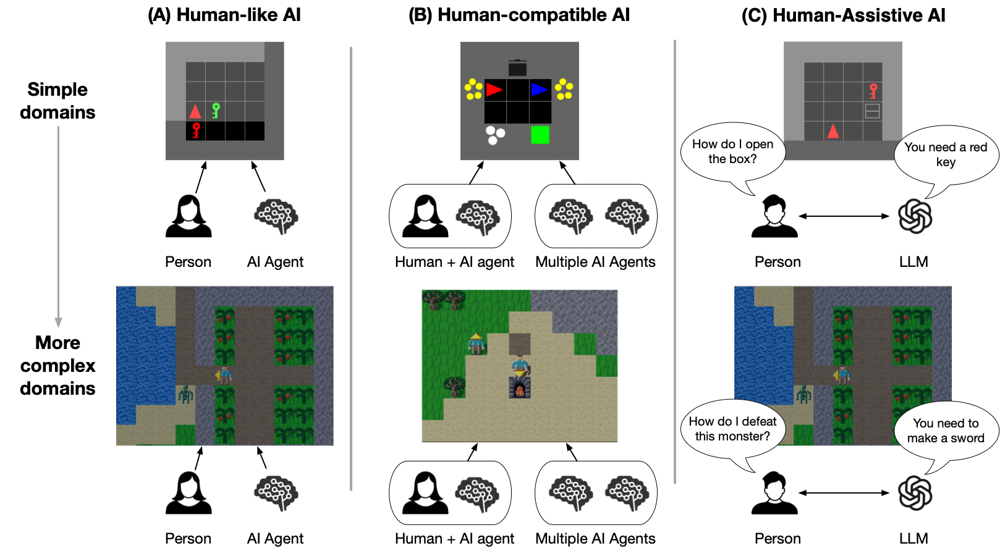
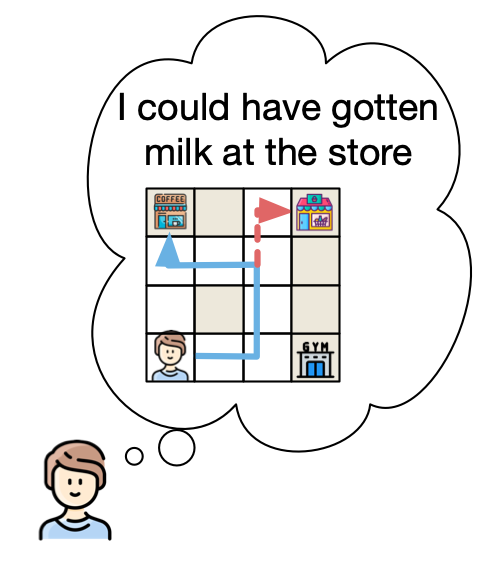
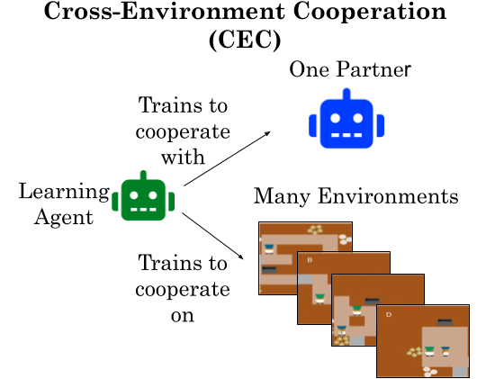
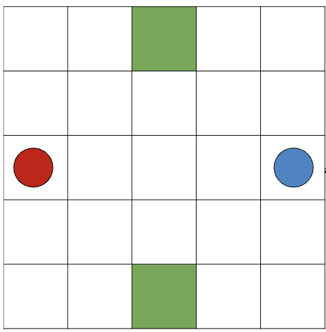
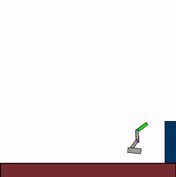

# NiceWebRL


This is the official repository of [NiceWebRL: a meta-environment for developing Human-like, Human-compatible, and Human-assistive AI](placeholder).

**Table of Contents**

* [Install](#install)
* [Functional example folders](#working-examples)
  * [Paper case studies](#paper-case-studies)
  * [More examples](#more-examples)
* [Other Jax environments compatible with NiceWebRL](#other-jax-environments-compatible-with-nicewebrl)


NiceWebRL is a Python library for quickly making human subject experiments that leverage machine reinforcement learning environments.




NiceWebRL enables researchers to use the same environments both to train and evaluate virtual agents, and to train and evaluate humans.
It supports both single-agent and multi-agent environments.
As such, NiceWebRL enables AI researchers to easily compare their algorithms to human performance, cognitive scientists to test ML algorithms as theories for human cognition, and multi-agent researchers to develop algorithms for human-AI collaboration.

To enable the use of machine learning environments in online experiments, it exploits [Jax](https://github.com/google/jax)—a high-performance numerical computing library—to reduce the latency from having clients communicate with a remote server.
To enable easy experiment design, NiceWebRL exploits [NiceGUI](https://nicegui.io/) to enable sophisticated GUI design entirely in Python.

To facilitate its adoption, we present several [working examples](#working-examples) that researchers can use to quickly set up their own experiments.
## Install

```bash
# pip install
pip install git+https://github.com/wcarvalho/nicewebrl

# more manually (first clone then)
conda create -n nicewebrl python=3.10 pip wheel -y
conda activate nicewebrl
pip install -e .
```

## Working Examples
### Paper case studies

We present three case studies for how NiceWebRL can help researchers develop either Human-like AI, Human-compatible AI, or Human-assistive AI. The first two are from two recent papers:

* [Preemptive Solving of Future Problems: Multitask Preplay in Humans and Machines](placeholder)
* [Cross-environment Cooperation Enables Zero-shot Multi-agent Coordination](https://arxiv.org/abs/2504.12714)

<table>
  <thead>
    <tr>
      <th>Description</th>
      <th>Visualization</th>
      <th>Installation</th>
      <th>Run Command</th>
    </tr>
  </thead>
  <tbody>
    <tr>
      <td><b>Case study 1 (Human-like AI)</b>: <a href="placeholder">Developing a novel Deep RL cognitive science model with NiceWebRL</a> [<a href="https://github.com/wcarvalho/multitask_preplay">folder</a>]</td>
      <td></td>
      <td></td>
      <td>see <a href="https://github.com/wcarvalho/multitask_preplay">Paper Repo</a></td>
    </tr>
    <tr>
      <td><b>Case study 2 (Human-compatible AI)</b>: <a href="https://arxiv.org/abs/2504.12714">Developing a novel MARL algorithm for coordinating with humans with NiceWebRL</a> [<a href="https://github.com/wcarvalho/nicewebrl/tree/main/examples/overcooked-CEC">folder</a>]</td>
      <td></td>
      <td>follow instructions in <code>examples/overcooked-CEC</code></td>
      <td><code>cd examples/overcooked-CEC; python web_app.py 'counter_circuit'</code></td>
    </tr>
    <tr>
      <td><b>Case study 3 (Human-assistive AI)</b>: Developing an LLM-assistant for sequential-decision making tasks in a virtual environment. [<a href="https://github.com/wcarvalho/nicewebrl/tree/main/examples/xland-LLM-assistant">folder</a>]</td>
      <td></td>
      <td><code>pip install -e ".[xland-assistant]"</code></td>
      <td><code>cd examples/xland-LLM-assistant; python web_app_assistant.py</code></td>
    </tr>
  </tbody>
</table>


### More examples
<table>
  <thead>
    <tr>
      <th>Description</th>
      <th>Visualization</th>
      <th>Installation</th>
      <th>Run Command</th>
    </tr>
  </thead>
  <tbody>
    <tr>
      <td> 2D Minecraft domain (single agent setting) [<a href="https://github.com/wcarvalho/nicewebrl/tree/main/examples/craftax">folder</a>]</td>
      <td></td>
      <td><code>pip install -e ".[craftax]"</code></td>
      <td><code>cd examples/craftax; python web_app.py</code></td>
    </tr>
    <tr>
      <td>XLand-Minigrid (single agent setting) [<a href="https://github.com/wcarvalho/nicewebrl/tree/main/examples/xland-minigrid">folder</a>]</td>
      <td></td>
      <td><code>pip install -e ".[xland]"</code></td>
      <td><code>cd examples/xland-minigrid; python web_app.py</code></td>
    </tr>
    <tr>
      <td>Minigrid (single agent setting, has PPO implementation) [<a href="https://github.com/wcarvalho/nicewebrl/tree/main/examples/minigrid-ppo">folder</a>]</td>
      <td></td>
      <td><code>pip install -e ".[craftax]"</code></td>
      <td><code>cd examples/minigrid-ppo; python web_app.py</code></td>
    </tr>
    <tr>
      <td>Minigrid with API-based LLM assistant [<a href="https://github.com/wcarvalho/nicewebrl/tree/main/examples/minigrid-LLM-assistant">folder</a>]</td>
      <td></td>
      <td><code>pip install -e "."</code></td>
      <td><code>cd examples/minigrid-LLM-assistant; python web_app_Gemini.py</code></td>
    </tr>
    <tr>
      <td>Minigrid with <b>local</b> LLM assistant [<a href="https://github.com/wcarvalho/nicewebrl/tree/main/examples/minigrid-LLM-assistant">folder</a>]</td>
      <td></td>
      <td><code>pip install -e "."</code></td>
      <td><code>cd examples/minigrid-LLM-assistant; python web_app_Local.py</code></td>
    </tr>
    <tr>
      <td>Dual Destination (Human-AI setting) [<a href="https://github.com/wcarvalho/nicewebrl/tree/main/examples/dual_destination-human-AI-CEC">folder</a>]</td>
      <td></td>
      <td><code>pip install -e ".[jaxmarl]"</code></td>
      <td><code>cd examples/dual_destination-human-AI-CEC; python web_app.py</code></td>
    </tr>
    <tr>
      <td>Overcooked (Human-Human setting) [<a href="https://github.com/wcarvalho/nicewebrl/tree/main/examples/overcooked-human-human">folder</a>]</td>
      <td></td>
      <td><code>pip install -e ".[jaxmarl]"</code></td>
      <td><code>cd examples/overcooked-human-human; python web_app.py</code></td>
    </tr>
  </tbody>
</table>


## Other Jax environments compatible with NiceWebRL

The following are all Jax environments which can be used with this framework to run human subject experiments. The power of using jax is that one can use the **exact** same environment for human subjects experiments as for developing modern machine learning algorithms (especially reinforcement learning algorithms).

When targetting normative solutions, one may want to study algorithms asymptotic behavior with a lot of data. Jax makes it cheap to do this. NiceWebRL makes it easy to compare these algorithms to human subject behavior.
<!--<table style="width:100%; border-collapse: collapse;">
  <tr style="max-height: 150px; overflow: hidden;">
    <td style="border: 1px solid black; padding: 10px; text-align: center;">
      <a href="https://github.com/MichaelTMatthews/Craftax" target="_blank" style="text-decoration: none; color: inherit;">
        <center><strong>Craftax</strong></center>
      </a><br>
      <a href="https://github.com/MichaelTMatthews/Craftax" target="_blank">
        
      </a>
      <p>This is a grid-world version of minecraft. </p>
    </td>
    <td style="border: 1px solid black; padding: 10px; text-align: center;">
      <a href="https://github.com/wcarvalho/JaxHouseMaze" target="_blank" style="text-decoration: none; color: inherit;">
        <center><strong>Housemaze</strong></center>
      </a><br>
      <a href="https://github.com/wcarvalho/JaxHouseMaze" target="_blank">
        
      </a>
      <p>This is a maze environment where new mazes can be easily be described with a string.</p>
    </td>
    <td style="border: 1px solid black; padding: 10px; text-align: center;">
      <a href="https://github.com/corl-team/xland-minigrid" target="_blank" style="text-decoration: none; color: inherit;">
        <center><strong>XLand-Minigrid</strong></center>
      </a><br>
      <a href="https://github.com/corl-team/xland-minigrid" target="_blank">
        
      </a>
      <p>This environment allows for complex, nested compositional tasks. XLand-Minigrid comes with 3 benchmarks which together defnine 3 million unique tasks.</p>
    </td>
  </tr>
  <tr style="max-height: 150px; overflow: hidden;">
    <td style="border: 1px solid black; padding: 10px; text-align: center;">
      <a href="https://github.com/epignatelli/navix" target="_blank" style="text-decoration: none; color: inherit;">
        <center><strong>Navix</strong></center>
      </a><br>
      <a href="https://github.com/epignatelli/navix" target="_blank">
        
      </a>
      <p>This is a jax implementation of the popular Minigrid environment.</p>
    </td>
    <td style="border: 1px solid black; padding: 10px; text-align: center;">
      <a href="https://github.com/FLAIROx/JaxMARL" target="_blank" style="text-decoration: none; color: inherit;">
        <center><strong>Overcooked (multi-agent)</strong></center>
      </a><br>
      <a href="https://github.com/FLAIROx/JaxMARL" target="_blank">
        
      </a>
      <p>This is a popular multi-agent environment.</p>
    </td>
    <td style="border: 1px solid black; padding: 10px; text-align: center;">
      <a href="https://github.com/FLAIROx/JaxMARL" target="_blank" style="text-decoration: none; color: inherit;">
        <center><strong>STORM (multi-agent)</strong></center>
      </a><br>
      <a href="https://github.com/FLAIROx/JaxMARL" target="_blank">
        
      </a>
      <p>This environment specifies Matrix games represented as grid world scenarios.</p>
    </td>
  </tr>
</table>
-->


<table>
  <thead>
    <tr>
      <th>Name</th>
      <th>Domain</th>
      <th>Visualization</th>
      <th>Goal</th>
    </tr>
  </thead>
  <tbody>
    <tr>
      <td><code>Craftax</code></td>
      <td>2D Minecraft</td>
      <td></td>
      <td>Mine and craft resources in a Minecraft-like 2D world</td>
    </tr>
    <tr>
      <td><code>Kinetix</code></td>
      <td>2D Physics Control</td>
      <td></td>
      <td>Control rigid 2D bodies to perform dynamic tasks</td>
    </tr>
    <tr>
      <td><code>Navix</code></td>
      <td>MiniGrid</td>
      <td></td>
      <td>Navigate grid environments with JAX-based MiniGrid variant</td>
    </tr>
    <tr>
      <td><code>XLand–MiniGrid</code></td>
      <td>XLand</td>
      <td></td>
      <td>Meta-RL tasks defined by dynamic rulesets</td>
    </tr>
    <tr>
      <td><code>JaxMARL</code></td>
      <td>Multi-agent RL</td>
      <td></td>
      <td>Cooperative and competitive multi-agent environments in JAX</td>
    </tr>
    <tr>
      <td><code>JaxGCRL</code></td>
      <td>Goal-Conditioned Robotics</td>
      <td></td>
      <td>Goal-conditioned control in simulated robotics tasks</td>
    </tr>
    <tr>
      <td><code>Gymnax</code></td>
      <td>Classic RL</td>
      <td></td>
      <td>Classic control, bsuite, and MinAtar environments in JAX</td>
    </tr>
    <tr>
      <td><code>Jumanji</code></td>
      <td>Combinatorial</td>
      <td></td>
      <td>From simple games to NP-hard combinatorial problems</td>
    </tr>
    <tr>
      <td><code>Pgx</code></td>
      <td>Board Games</td>
      <td></td>
      <td>Chess, Go, Shogi, and other turn-based strategy games</td>
    </tr>
    <tr>
      <td><code>Brax</code></td>
      <td>Physics Simulation</td>
      <td></td>
      <td>Differentiable physics engine for continuous control</td>
    </tr>
  </tbody>
</table>